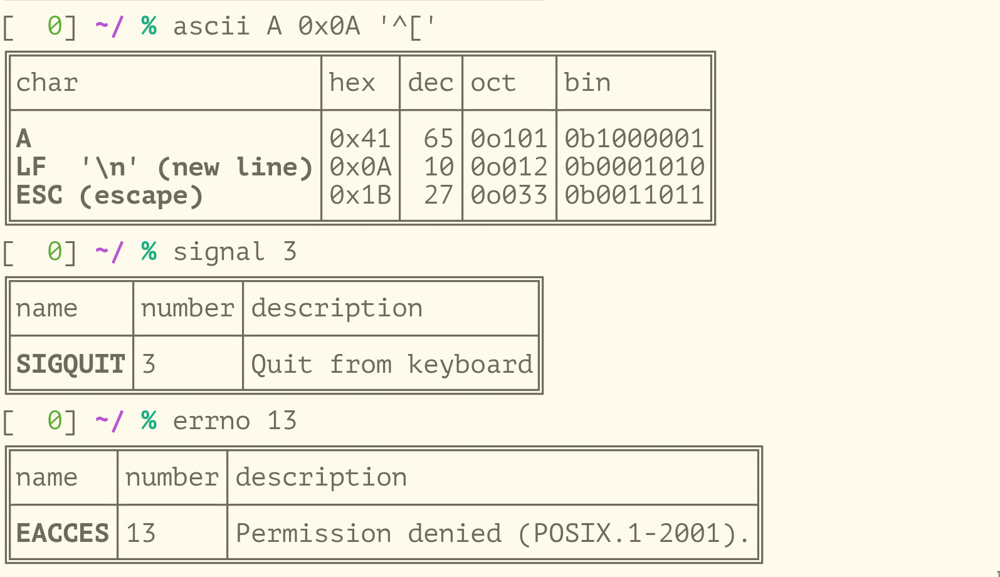

# lookup-utils



This repository provides following commands:

- `ascii`: lookup ASCII code
- `signal`: lookup Linux signals
- `errno`: lookup Linux error numbers

## Installation

To install:
```
$ git clone https://github.com/algon-320/lookup-utils && cd lookup-utils
$ cargo install --path . --bins

$ # install only the specified command
$ cargo install --path . --bin ascii   
$ cargo install --path . --bin signal
$ cargo install --path . --bin errno
```

To uninstall:
```
$ cargo uninstall lookup-utils
```

## Common options

- `--simple`: disable pretty printing


## `ascii` examples

Lookup ASCII code by character:
```
$ ascii A
╔════╤════╤═══╤═════╤═════════╗
║char│hex │dec│oct  │bin      ║
╟────┼────┼───┼─────┼─────────╢
║A   │0x41│ 65│0o101│0b1000001║
╚════╧════╧═══╧═════╧═════════╝
```

Lookup characters by ASCII code:
```
$ ascii 0x42 0b1000011 0o104 69
╔════╤════╤═══╤═════╤═════════╗
║char│hex │dec│oct  │bin      ║
╟────┼────┼───┼─────┼─────────╢
║B   │0x42│ 66│0o102│0b1000010║
║C   │0x43│ 67│0o103│0b1000011║
║D   │0x44│ 68│0o104│0b1000100║
║E   │0x45│ 69│0o105│0b1000101║
╚════╧════╧═══╧═════╧═════════╝
```

Lookup a control character by [caret notation](https://en.wikipedia.org/wiki/Caret_notation):
```
$ ascii '^['
╔════════════╤════╤═══╤═════╤═════════╗
║char        │hex │dec│oct  │bin      ║
╟────────────┼────┼───┼─────┼─────────╢
║ESC (escape)│0x1B│ 27│0o033│0b0011011║
╚════════════╧════╧═══╧═════╧═════════╝
```

## `signal` examples

Lookup a signal by signal number:
```
$ signal 2
╔══════╤══════╤═══════════════════════╗
║name  │number│description            ║
╟──────┼──────┼───────────────────────╢
║SIGINT│2     │Interrupt from keyboard║
╚══════╧══════╧═══════════════════════╝
```

Lookup a signal by a status code returned by standard shells:
```
$ signal -s 130
╔══════╤══════╤═══════════════════════╗
║name  │number│description            ║
╟──────┼──────┼───────────────────────╢
║SIGINT│2     │Interrupt from keyboard║
╚══════╧══════╧═══════════════════════╝
```

Lookup a signal by name:
```
$ signal SIGINT
╔══════╤══════╤═══════════════════════╗
║name  │number│description            ║
╟──────┼──────┼───────────────────────╢
║SIGINT│2     │Interrupt from keyboard║
╚══════╧══════╧═══════════════════════╝
```

## `errno` examples

Lookup an error by error number:
```
$ errno 10
╔══════╤══════╤══════════════════════════════════╗
║name  │number│description                       ║
╟──────┼──────┼──────────────────────────────────╢
║ECHILD│10    │No child processes (POSIX.1-2001).║
╚══════╧══════╧══════════════════════════════════╝
```

Lookup an error by symbolic name:
```
$ errno ECHILD
╔══════╤══════╤══════════════════════════════════╗
║name  │number│description                       ║
╟──────┼──────┼──────────────────────────────────╢
║ECHILD│10    │No child processes (POSIX.1-2001).║
╚══════╧══════╧══════════════════════════════════╝
```

